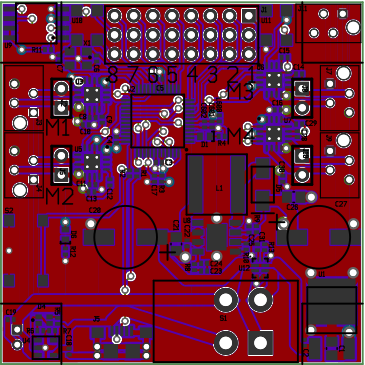

# SnekBoard #

Here's a fairly simple computer designed to support Lego Power
Functions devices and run either Snek or Circuit Python, or even
Arduino code.

## Hardware ##

 * SAMD21G processor. This is the same chip used in many Arduino
   designs, including the Adafruit Metro M0 Express

 * Single cell lithium polymer battery. Compact, powerful, and
   easy to support.

 * Built-in USB battery charger. Charges at 800mA.

 * 3.3V 3A power supply. Plenty of current to support external
   devices.

 * 9V 4.5A boost power supply. Lego Power functions all work on 9V, so
   this supply provides the required voltage without needing 6 1.5V cells.

 * 4 10.5V 1.5A motor controllers. The board can drive up to 4 bi-directional
   motors.

 * 8 3.3V GPIOs. These are provided on an 8x3 header along with power
   and ground.

 * 2MB NOR flash part. This provides program storage for Circuit
   Python.

## License ##

SnekBoard is licensed under the TAPR Open Hardware License.
